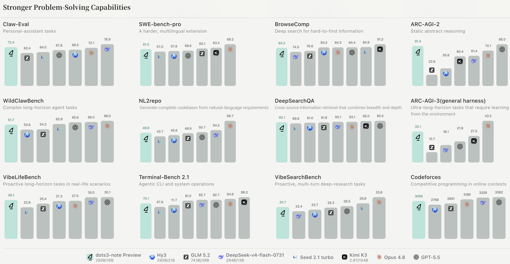
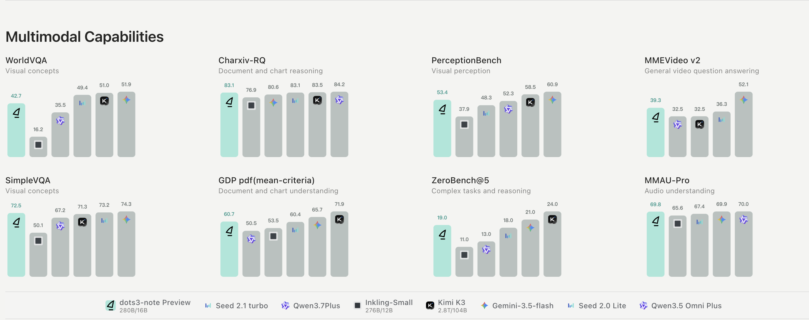
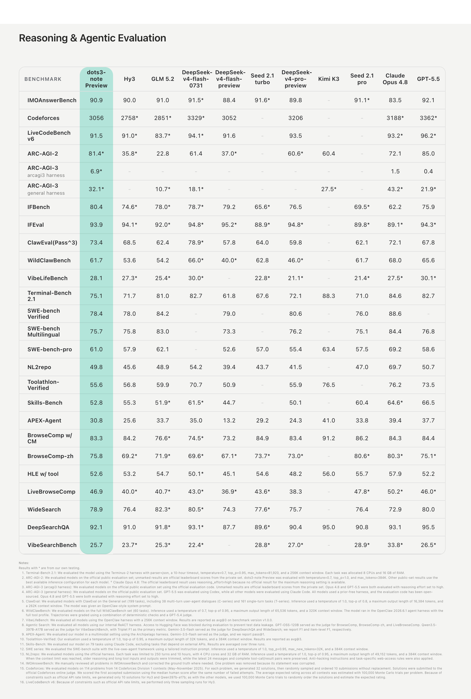
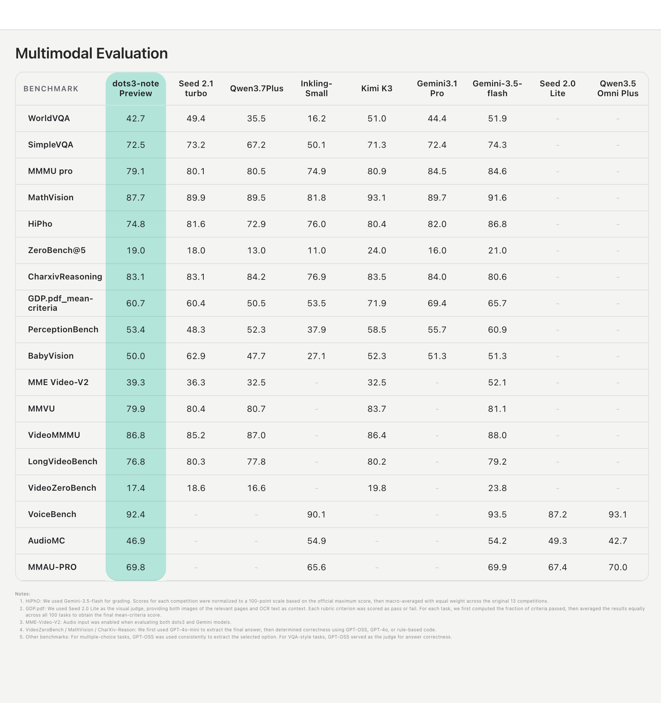

<p align="left">
  <a href="README_CN.md">中文</a>&nbsp;｜&nbsp;English
</p>
<br>

<div align="center">
  
  <h1>dots3-note Preview</h1>
</div>

<div align="center" style="line-height: 1;">
  <a href="https://huggingface.co/dots-studio/dots3-note-prev"></a>
  <a href="https://github.com/huggingface/transformers/pull/47844"></a>
  <a href="https://github.com/sgl-project/sglang/pull/33829"></a>
  <a href="https://recipes.vllm.ai/dots-studio/dots3-note-prev"></a>
  <a href="https://modelscope.cn/collections/dots-studio/dots3-note"></a>

  <a href="https://xhslink.cn/m/7vLoWFQV0wN"></a>
  <a href="https://discord.gg/haym6hEUE"></a>
  <a href="https://x.com/dotsstudioai"></a>
  <a href="#license"></a>
</div>

<p align="center">
  🌐&nbsp;<a href="https://studio.dots.ai/dots/dots3-en.html"><b>Tech Blog</b></a>&nbsp;&nbsp;|&nbsp;&nbsp;
  📄&nbsp;<b>Full Report (coming soon)</b>
</p>

---


## Table of Contents

- [Model Introduction](#model-introduction)
- [Model Overview](#model-overview)
- [Evaluation Results](#evaluation-results)
  - [General Reasoning and Agent](#general-reasoning-and-agent)
  - [Multimodal Understanding](#multimodal-understanding)
- [Model Links](#model-links)
- [Quickstart](#quickstart)
- [Deployment](#deployment)
  - [Transformers](#transformers)
  - [SGLang](#sglang)
  - [vLLM](#vllm)
- [Benchmark Appendix](#benchmark-appendix)
- [License](#license)
- [Contact Us](#contact-us)

---

## Model Introduction

dots3-note preview is the first open-weight model in the dots3 family. It is a Mixture-of-Experts model with 280B total parameters, 16B activated parameters, and support for a context length of up to 512K tokens. The model can understand text, images, video, and audio, and produces text outputs.

dots3-note preview is optimized for a broad range of tasks, including:

- general knowledge and instruction following;
- mathematical and logical reasoning;
- tool use and multi-step agent workflows;
- interactive tasks that require exploration, memory updates, and adaptation;
- code generation and code-based problem solving;
- image, document, chart, audio, and video understanding;
- long-context information processing.

The dots3 family is designed to include models with different trade-offs among capability, latency, and inference cost. dots3-note preview is the most lightweight member of the family.


## Model Overview

| Property | Value |
| :--- | :--- |
| Architecture | Multimodal MoE |
| Total Parameters | 280B |
| Activated Parameters | 16B |
| MTP | 1 shared layer, 1.13B |
| Number of Layers | 1 dense + 45 MoE |
| Hidden Size | 5120 |
| FFN Hidden Size | 13824 (dense), 1536 (per expert) |
| Experts | 256 routed + 1 shared, top-8 |
| Attention | 13 DSA + 33 SWA (~1:3) |
| DSA | Top-2048 |
| Context Length | 512K |
| Vocabulary Size | 152K |
| Vision Encoder | MoE ViT, 7B total, 1.2B activated |
| Audio Encoder | Dense, 800M |
| Supported Precision | BF16, FP8 |
| Input | Text, image, video, audio |
| Output | Text |


## Evaluation Results

### General Reasoning and Agent



### Multimodal Understanding



## Model Links

| Model Name | Description | HuggingFace | ModelScope |
| --- | --- | --- | --- |
| dots3-note-prev | Preview multimodal model | 🤗 [Model](https://huggingface.co/dots-studio/dots3-note-prev) |  [Model](https://modelscope.cn/models/dots-studio/dots3-note-prev) |
| dots3-note-prev-fp8 | FP8-quantized preview multimodal model | 🤗 [Model](https://huggingface.co/dots-studio/dots3-note-prev-fp8) |  [Model](https://modelscope.cn/models/dots-studio/dots3-note-prev-fp8) |

## Quickstart

Recommended: serve the FP8 checkpoint on one 8-GPU node with [SGLang](#sglang) or [vLLM](#vllm).

```python
from openai import OpenAI

client = OpenAI(base_url="http://127.0.0.1:8000/v1", api_key="EMPTY")

response = client.chat.completions.create(
    model="dots3-note-prev",
    messages=[
        {"role": "user", "content": "Hello! Can you briefly introduce yourself?"},
    ],
    temperature=1.0,
    top_p=0.95,
    max_tokens=256,
    # Set enable_thinking=True for reasoning; False returns a direct response.
    extra_body={"chat_template_kwargs": {"enable_thinking": False}},
)
print(response.choices[0].message.content)
```

For a multimodal request, replace `messages` with one of these public examples:

```python
examples = {
    "image": [
        {"type": "image_url", "image_url": {"url": "https://huggingface.co/datasets/huggingface/documentation-images/resolve/main/cats.png"}},
        {"type": "text", "text": "How many cats are in this image?"},
    ],
    "audio": [
        {"type": "audio_url", "audio_url": {"url": "https://huggingface.co/datasets/hf-internal-testing/dummy-audio-samples/resolve/main/mary_had_lamb.mp3"}},
        {"type": "text", "text": "Transcribe this nursery rhyme."},
    ],
    "video": [
        {"type": "video_url", "video_url": {"url": "https://huggingface.co/datasets/merve/vlm_test_images/resolve/main/concert.mp4"}},
        {"type": "text", "text": "Describe the performance and what can be heard."},
    ],
}
messages = [{"role": "user", "content": examples["image"]}]
```

Video inputs include their audio track when available.

## Deployment

The commands below target FP8 on one 8-GPU node. BF16 requires more memory. Tune the context length to available memory, concurrency, and input modalities.

Native support is available on [vLLM](https://recipes.vllm.ai/dots-studio/dots3-note-prev) `main`. [Transformers #47844](https://github.com/huggingface/transformers/pull/47844) and [SGLang #33829](https://github.com/sgl-project/sglang/pull/33829) are still under review; until they are merged, use the PR revisions below.

### Transformers

First install mutually compatible [PyTorch and torchvision](https://pytorch.org/get-started/locally/) builds supported by your NVIDIA driver. For audio and video, also install a PyTorch-compatible `torchcodec` (included below) and FFmpeg with your system package manager. Then install [Transformers #47844](https://github.com/huggingface/transformers/pull/47844):

```bash
pip install accelerate pillow torchcodec kernels==0.16.0 "transformers @ git+https://github.com/huggingface/transformers.git@refs/pull/47844/head"
```

Run a minimal local inference:

```python
from transformers import AutoModelForMultimodalLM, AutoProcessor

model_id = "dots-studio/dots3-note-prev-fp8"
processor = AutoProcessor.from_pretrained(model_id)
model = AutoModelForMultimodalLM.from_pretrained(model_id, dtype="auto", device_map="auto")

messages = [
    {"role": "user", "content": "Hello! Please briefly introduce yourself."},
]
inputs = processor.tokenizer.apply_chat_template(
    messages,
    add_generation_prompt=True,
    return_tensors="pt",
    return_dict=True,
    enable_thinking=False,
).to(model.device)
outputs = model.generate(**inputs, max_new_tokens=128)
print(processor.decode(outputs[0, inputs.input_ids.shape[1] :], skip_special_tokens=True))
```

Use SGLang or vLLM for multi-GPU OpenAI-compatible serving.

### SGLang


Recommended: use the release image [lmsysorg/sglang:dev-dots3-note](https://hub.docker.com/r/lmsysorg/sglang/tags). Full one-node recipes and tuning notes are in the [Dots3-Note cookbook](https://github.com/sgl-project/sglang/blob/main/docs/cookbook/autoregressive/RedNote/Dots3-Note.mdx). Source support is tracked in [SGLang #33829](https://github.com/sgl-project/sglang/pull/33829).

Docker (the image downloads the checkpoint from Hugging Face on first run):

```bash
docker run --gpus all --ipc=host -p 8000:8000 \
  lmsysorg/sglang:dev-dots3-note \
  sglang serve \
    --model-path dots-studio/dots3-note-prev-fp8 \
    --served-model-name dots3-note-prev \
    --host 0.0.0.0 \
    --port 8000 \
    --context-length 524288 \
    --enable-dp-attention \
    --dp-size 8 \
    --tp-size 8 \
    --ep-size 8 \
    --moe-dense-tp-size 1 \
    --page-size 64 \
    --trust-remote-code \
    --attention-backend fa3 \
    --moe-a2a-backend deepep \
    --enable-multimodal \
    --speculative-algorithm NEXTN \
    --speculative-num-steps 3 \
    --speculative-eagle-topk 1 \
    --speculative-num-draft-tokens 4 \
    --speculative-draft-model-path dots-studio/dots3-note-prev-fp8
```

Or install from source / the PR and run the same `sglang serve` arguments locally. `--attention-backend fa3` sets prefill, decode, and (when speculative decoding is enabled) draft attention. MTP/NEXTN (`--speculative-algorithm NEXTN` and the related flags) is optional and can reduce TPOT by more than 50%. Prefill CUDA graph is not supported yet.

Optional features:

```bash
# Load only the language model
--language-only

# Enable OpenAI-compatible tool calling
--tool-call-parser dots
```

### vLLM

Native dots3-note preview support is available on [vLLM](https://recipes.vllm.ai/dots-studio/dots3-note-prev) `main`. Use a recent nightly build until it is included in a stable release.

The following example deploys the FP8 checkpoint on eight NVIDIA H100 GPUs with TP=8 and EP=8:

```bash
vllm serve dots-studio/dots3-note-prev-fp8 \
  --served-model-name dots3-note-prev \
  --host 0.0.0.0 \
  --tensor-parallel-size 8 \
  --enable-expert-parallel \
  --moe-backend deep_gemm \
  --max-model-len 262144
```

Optional features:

```bash
# Load only the language model
--language-model-only

# Enable three-token MTP speculative decoding
--speculative-config '{"method":"mtp","num_speculative_tokens":3}'

# Enable OpenAI-compatible automatic tool calling
--enable-auto-tool-choice --tool-call-parser dots

```

## Benchmark Appendix





## License

Copyright (c) 2026 Xiaohongshu.

Developed and released by dots studio.

The dots3-note preview model weights are released under the Apache License 2.0 and are available on [Hugging Face](https://huggingface.co/dots-studio/dots3-note-prev) and [ModelScope](https://modelscope.cn/models/dots-studio/dots3-note-prev). The documentation and assets in this repository are released under the same license.

See the LICENSE file for details.

Transformers, SGLang, vLLM, and other third-party software are subject to their respective licenses.


## Contact Us

For questions and feedback, please contact us through:

- Email: dots-model-feedback@xiaohongshu.com

---

<p align="center">

<i>dots3-note preview is developed and released by dots studio.</i>

</p>
